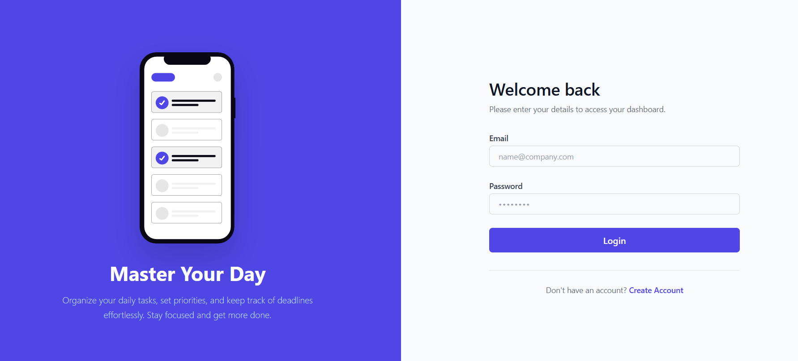
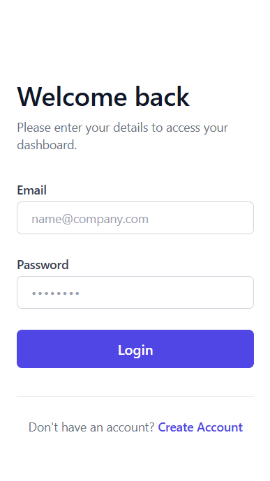
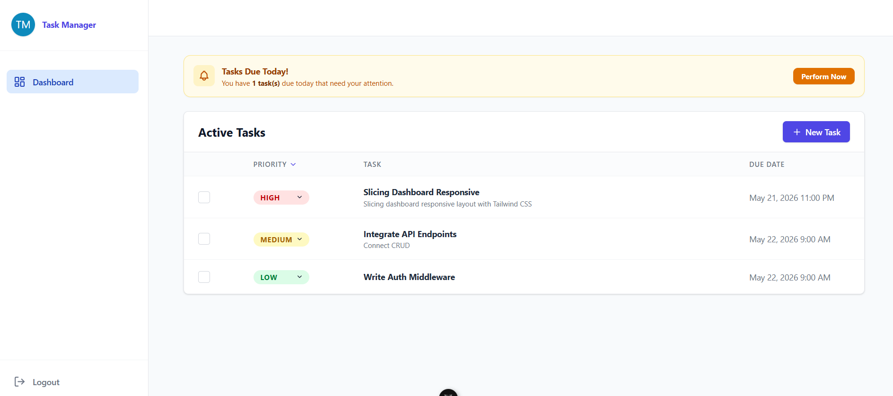
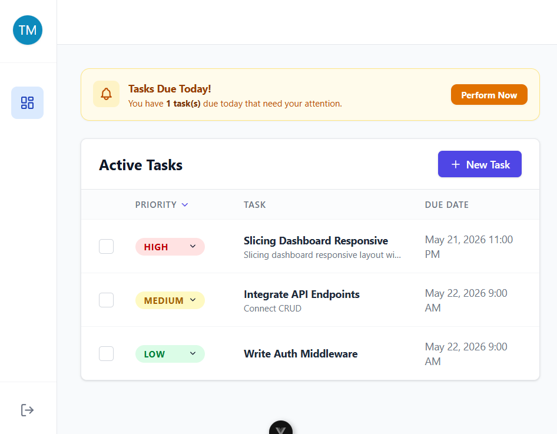
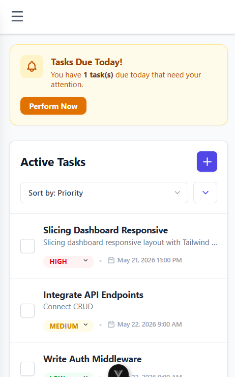
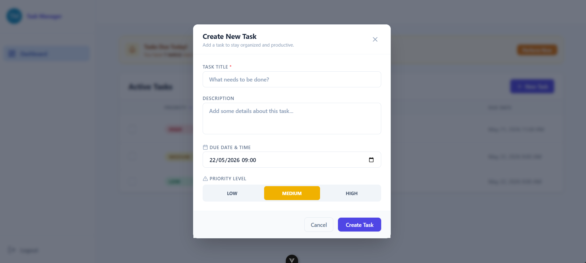
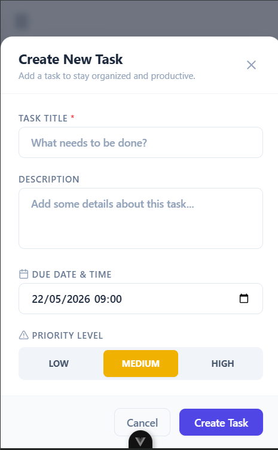

# Task Manager Challenge

A full-stack task management web application built as part of the technical assessment.

## User Interface Showcase

### Authentication (Login Page)
| Desktop View | Mobile View |
| :---: | :---: |
|  |  |

### Active Tasks Dashboard
| Desktop View | Tablet View | Mobile View |
| :---: | :---: | :---: |
|  |  |  |

### Task Creation
| Desktop View | Mobile View |
| :---: | :---: |
|  |  |


## Tech Stack

### Frontend
- Core: Vue 3 & TypeScript
- Build Tool: Vite
- Styling: Tailwind CSS
- Date Utility: Day.js
- Icons: Lucide Vue

### Backend
- Core: Node.js & Express
- Database ORM: Sequelize (PostgreSQL dialect)
- Authentication: JSON Web Tokens (JWT) & BcryptJS

## Setup and Installation

### Backend Setup (`/server`)

1. Navigate to the server directory:
   ```bash
   cd server
   ```

2. Install dependencies:
   ```bash
   npm install
   ```

3. Configure environment variables. Create a `.env` file in the `/server` directory using the provided `.env.example` as a template:
   ```env
   NODE_ENV="development"
   PORT=3000
   DATABASE_URL="postgresql://<username>:<password>@localhost:5432/<database_name>"
   JWT_SECRET_KEY="your-super-secure-jwt-key"
   ```

4. Run migrations and database seeds:
   ```bash
   npm run db:create    # If database doesn't exist yet
   npx sequelize-cli db:migrate
   ```

5. Start the development server:
   ```bash
   npm run dev
   ```
   The backend will run on `http://localhost:3000`.

---

### Frontend Setup (`/client`)

1. Navigate to the client directory:
   ```bash
   cd ../client
   ```

2. Install dependencies:
   ```bash
   npm install
   ```

3. Configure environment variables. Create a `.env` file in the `/client` directory:
   ```env
   VITE_API_BASE_URL=http://localhost:3000/api/v1
   ```

4. Start the development server:
   ```bash
   npm run dev
   ```
   The application will be accessible at `http://localhost:5173`.
